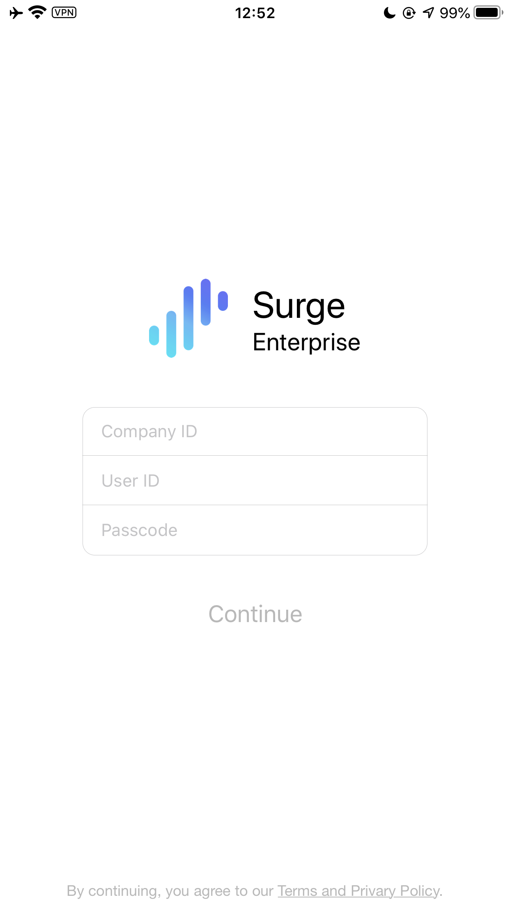
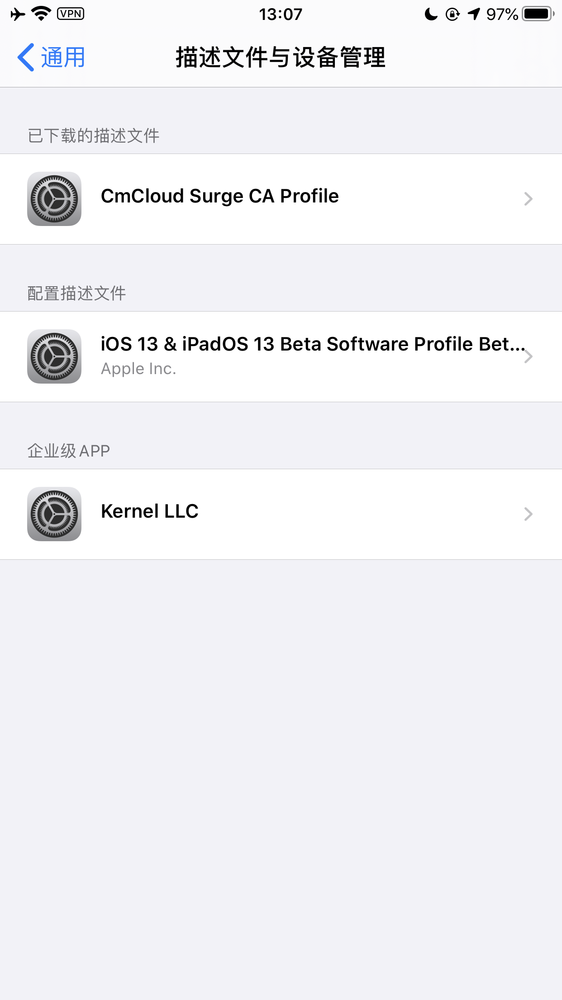

# Surge 使用教程

## 概述

Surge for iOS 已经更新到版本 4。由于所有 Surge 3 的付费用户都可以免费升级到 Surge 4，而进行订阅配置的基础功能不涉及 Surge 4 的功能订阅。因此「厘米云」文档将以 Surge 4 为基础进行说明和演示。


这是一个付费软件，如果您未订阅厘米云，则需要购买才能使用。



此篇教程不适用于商店版 Surge


## 系统环境

> 在此文章撰写时…
>
> iPhone10,2 / 13.3.1\(17D50\)
>
> Surge 4.1.1E Build 1456 BETA

## 激活设备

如果你的套餐拥有 Surge 享受权，可以联系在线客服，或者发送工单获取 Surge 授权信息。


软件启动时会默认订阅本站绑定会员的配置文件，请勿借出订阅与他人，因此导致的流量问题一概自行买账。


将获取到的信息按照要求填入软件输入框内点击 `Continue` 

## 选择节点

点击切换到策略组页面选择 `Proxy` 你所希望使用的节点。

## 代理启用

点击切换到首页通过 `启动` 按钮来激活你的代理。

## 启用MitM

通过 Safari 打开 [https://download.iplc.wiki/s/cml9kg36](https://download.iplc.wiki/s/cml9kg36) 

下载该证书文件，iOS 会提示此网站正在尝试显示一个配置描述文件，请点击允许。

> 如果区域内有其他 Apple 设备，例如 Apple Watch / HomePod 等，则还需要选择描述文件安装位置，请选择 iPhone

打开「设置」应用程序，然后依次点击「通用 – 描述文件（描述文件和设备管理）」，可以查看到新下载的证书描述文件。

点击「CmCLoud Surge CA Profile」，并安装

返回「设置」App 的「通用」部分，然后点击「关于本机」，在底部找到并进入「证书信任设置」。

打开「CmCloud Surge CA Profile」的信任开关，并在弹出的系统警告中点击「继续」。

现在已经全部完成！返回到 Surge 应用程序然后打开 `MitM` 与 `脚本` 功能开关即可开始享受~

