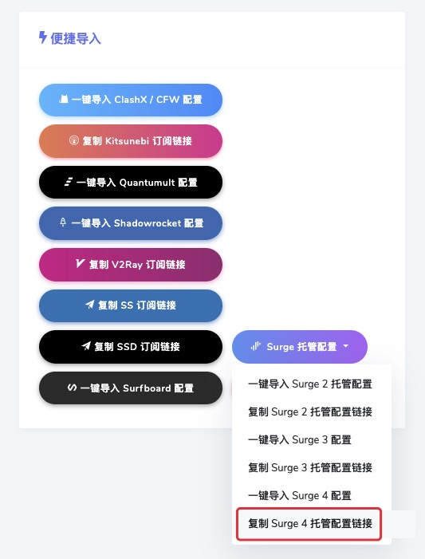
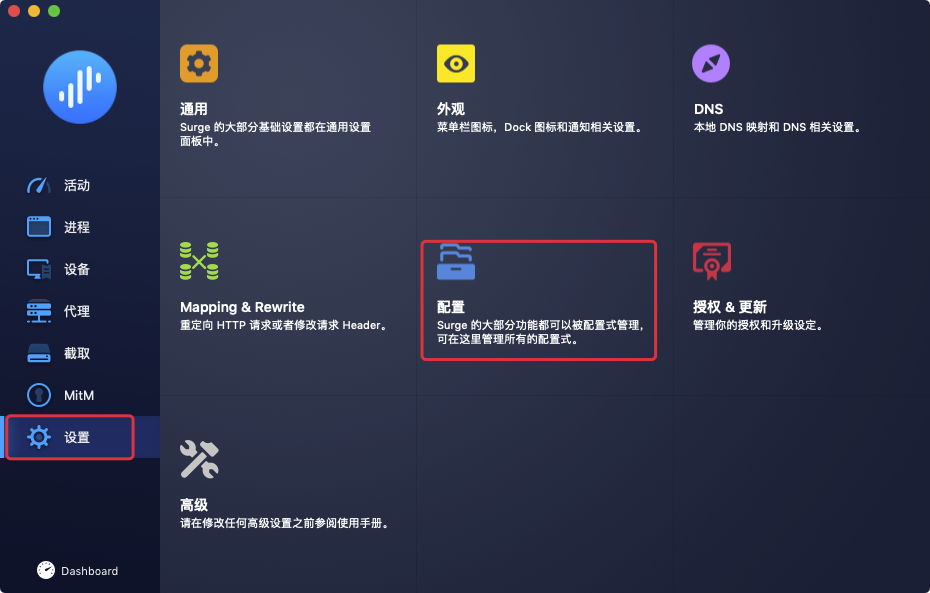
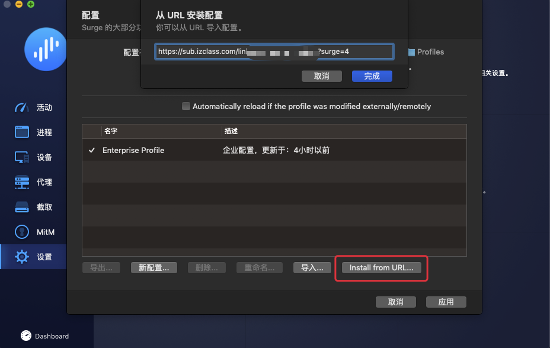
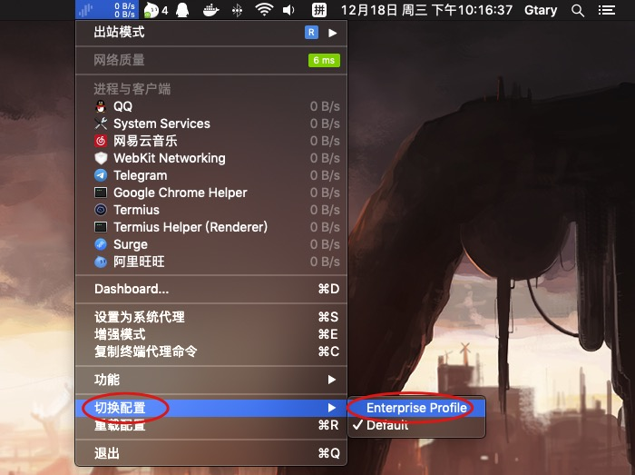
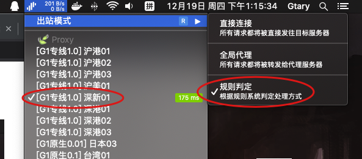
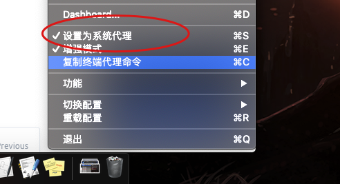

# Surge 使用教程


Surge for macOS 的授权是与 iOS 互不关联的，需要单独购买。



这是一个付费软件，如果您未订阅厘米云，则需要购买才能使用。


## 系统环境

> 在此文章撰写时…  
> macOS Mojave 10.14.6  
> Surge Mac 3.3.2 \(Build 915\)

## 下载安装

* 官方下载：[Surge Mac 3.2.1 \(Build 864\)](https://nssurge.com/mac/v3/Surge-latest.zip)
* 本站托管：[Surge Mac 3.2.1 \(Build 915\)](https://download.iplc.wiki/%E9%99%84%E4%BB%B6/wiki/macOS/Surge%203%202.zip)

> 推荐使用本站托管版本，官网版本下载安装后仍需更新版本
>
> `915` 与 `864` 最大区别在于 VMESS 协议的支持，如不使用本站版本可能无法下载包含 VMESS 协议的配置文件


如果你是用本站订阅则需选择企业授权激活，反则使用你购买时信息激活


## 获取订阅


如果使用本站 Enterprise 订阅请跳过此步骤


* 在用户中心首页选择`Surge 托管配置` 之后点击 `复制 Surge 4 托管配置链接` 

* 在 Surge 面板切换到 `设置` 页面，点击`配置按钮` 

* 点击 `Install from URL...` ，在弹窗页面填入刚刚复制的地址

## 配置激活

右击菜单栏 Surge 图标，将光标移动到 `切换配置` 选择 `Enterprise Profile` 即可激活本站配置文件


如果你是用的自购买授权或许这里的配置文件名为 `IPLCM.conf`


## 节点选择

通过右击 Surge 菜单栏图标来快速的选择图标与您的出站方式

## 代理启用

在系统菜单栏中右击 Surge 图标，下滑找到 `设置为系统代理` ，并将其选中


此外，某些应用程序可能不遵循系统代理（如终端）。对于这部分应用程序，如果需要其流量通过 「厘米云」 网络，你需要打开 Surge 的「增强模式」。


