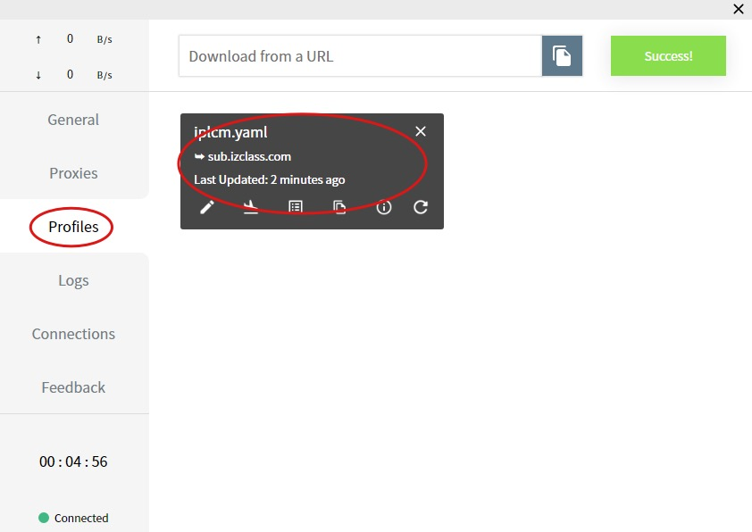
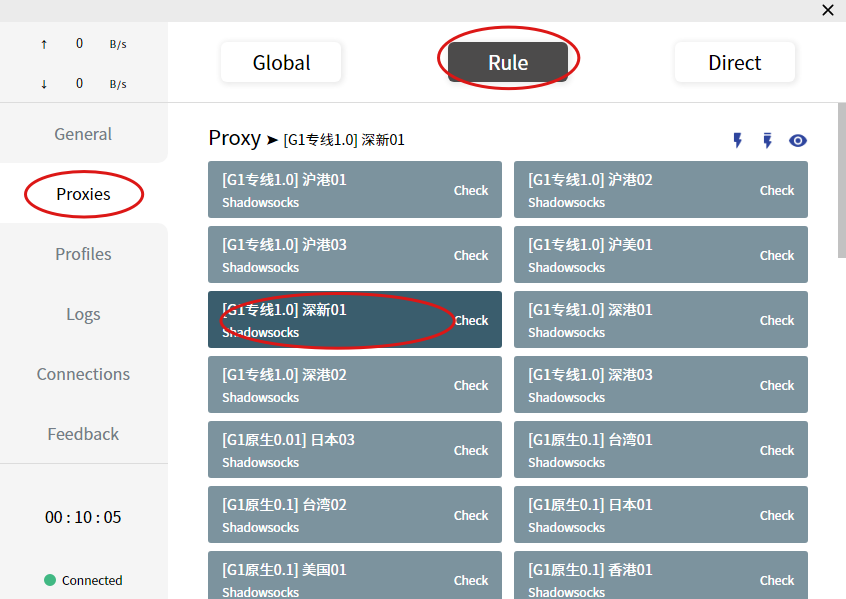
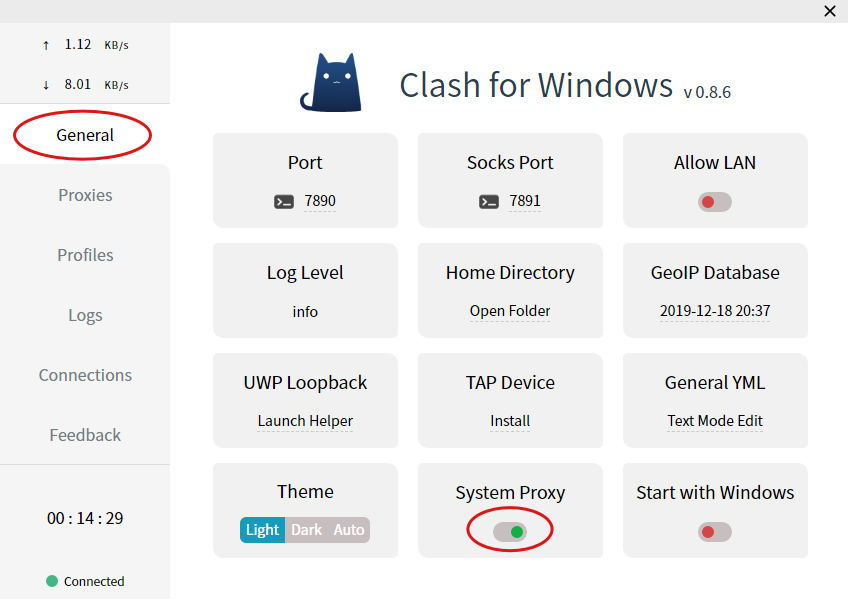
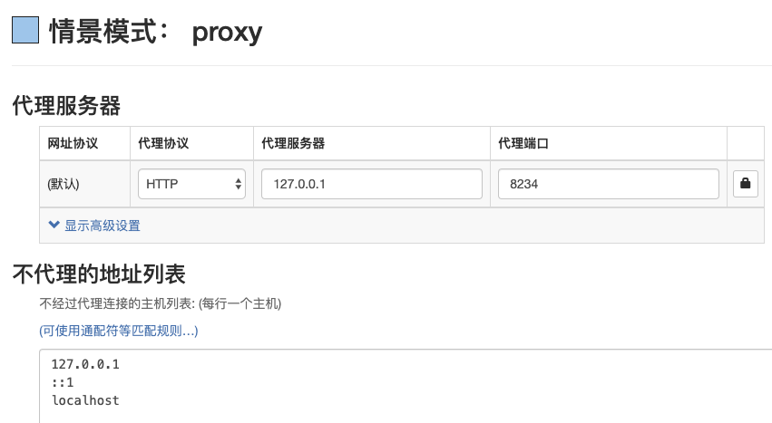

# Clash 使用教程


此教程针对于 64 位 Windows 7 以上版本系统



这是一个非开源软件，如遇使用问题请反馈至项目 issues



此软件不支持 `SSR` 协议链接


## 系统环境

> 在此文章撰写时…  
> Windows 10 LTSC 1809 64bit  
> Clash for Windows 0.8.10

## 下载安装 

* 最新 GitHub Releases：[Fndroid](https://github.com/Fndroid/clash_for_windows_pkg/releases)
* 本站托管下载：[Clash for Windows 0.8.10](https://download.iplc.wiki/s/b1a37iq4)

> 如遇下载失败请与我们联系，下载完成后尽可能使用管理员权限安装/运行

## 获取订阅 

通过[用户中心](https://qq.com.iplcm.club/user)的一键导入 CFW 按钮来一键导入订阅

> 随着时间推逝网址可能失效，不过你可以访问 affcm.com 获取最新地址


如果无法一键导入，或者未唤起软件，请复制`SSR`订阅，修改最末的`sub=1`为`clash=1`手动导入即可。


## 配置激活 

更新成功后，通过选择软件的`Profiles` 页面，点击你刚刚下载的文件而激活使用这份配置文件。

## 节点选择 

成功激活之后，切换到`Proxies` 页面，点击`Rule` 按钮，展开`Proxy` 列表选择你所需的节点进行链接。

## 代理启用 

最后一步，切换到`General` 页面，打开 `System Proxy` 即可启用代理。

## 其他工具 

你也可以选择通过 [Proxy SwitchyOmega](https://chrome.google.com/webstore/detail/proxy-switchyomega/padekgcemlokbadohgkifijomclgjgif) 来链接 Clash 开启的本地 HTTP 或者SOCKS 代理。

